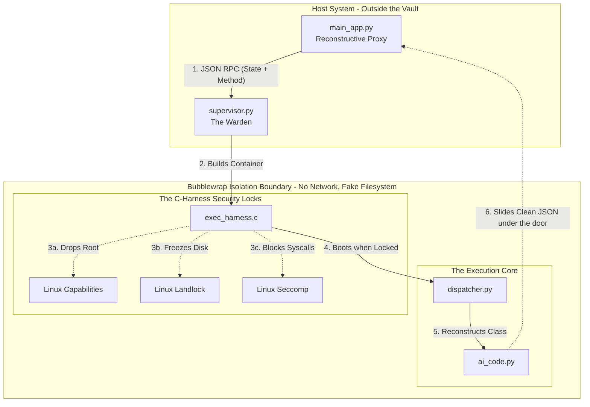
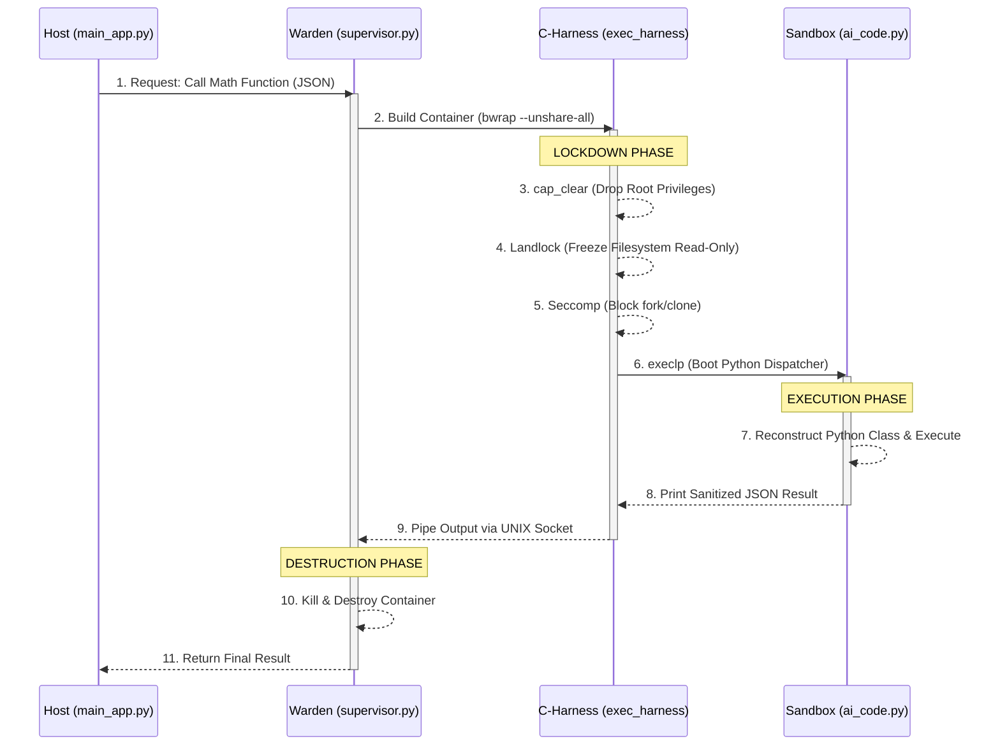

# Enterprise Security Architecture: Zero-Trust AI Sandbox

## 1. Executive Summary
This document outlines the **Defense-in-Depth** architecture used to secure the execution of unverified, untrusted AI-generated code. 

Standard sandboxes (like basic Docker containers) are vulnerable to kernel exploits, network exfiltration, and privilege escalation. To solve this, we engineered an **Ephemeral, Stateless RPC Sandbox** powered by a native C-binary harness. This system mathematically isolates the AI code, physically severing it from the host network, filesystem, and kernel root privileges. 

Every single function execution boots a pristine, heavily-armored vault, runs the calculation, and instantly destroys the vault, leaving a microscopic attack surface.

---

## 2. Architecture & Threat Model

We employ a "Russian Nesting Doll" security model. If a malicious AI bypasses one lock, it immediately encounters an entirely different security paradigm.
### 2.1 Spatial Architecture 
This flowchart demonstrates the physical boundaries and layers of isolation between the Host and the AI code.

### 2.2 Execution Flow (The Timeline)
This sequence diagram demonstrates the exact millisecond-by-millisecond timeline of how a function is executed and the vault is destroyed.

---

## 3. The 4 Pillars of Defense-in-Depth

### Pillar 1: Total Network & Mount Isolation (Bubblewrap)
* **The Mechanism:** Linux Namespaces (`bwrap --unshare-all`).
* **How it works:** The Sandbox is completely detached from the host. It runs in an empty PID namespace (it cannot see host processes) and an empty Network namespace. The host's `/app` directory is never mounted into the container.
* **Threats Defeated:** Data Exfiltration (it cannot transmit stolen data via the internet), Host File Theft (the host files mathematically do not exist in its universe), and Botnet deployment.

### Pillar 2: Privilege Annihilation (Linux Capabilities)
* **The Mechanism:** Native C-calls to `prctl(PR_SET_KEEPCAPS)` and `cap_clear()`.
* **How it works:** Instead of relying on Python, the native C-Harness manually strips away the "root" capabilities of the process before the AI boots, and sets the `NO_NEW_PRIVS` kernel flag. 
* **Threats Defeated:** Privilege Escalation. Even if the AI discovers a zero-day Kernel exploit that attempts to grant it root access, the Kernel will permanently reject the request.

### Pillar 3: Filesystem Freezing (Linux Landlock)
* **The Mechanism:** Raw Kernel Module (`SYS_landlock_create_ruleset`).
* **How it works:** While Bubblewrap provides a fake filesystem, Landlock acts as an un-bypassable secondary lock. The C-Harness commands the deepest layer of the Linux Kernel to permanently freeze the container's virtual hard drive as Read-Only. 
* **Threats Defeated:** Ransomware, File Corruption, and Self-Modification (the AI cannot overwrite its own execution script to change the system's behavior).

### Pillar 4: CPU Instruction Blocking (Seccomp)
* **The Mechanism:** Secure Computing System Calls (`seccomp_rule_add`).
* **How it works:** The C-Harness modifies the CPU permissions of the process, explicitly banning the `fork`, `vfork`, `clone`, and `clone3` instructions.
* **Threats Defeated:** Remote Code Execution (RCE), Fork Bombs, and Reverse Shells. If the AI attempts to use `os.system("bash")`, the Linux CPU refuses to execute the command and instantly kills the process.

---

## 4. The "Stateless Proxy" Pipeline

Because the container is so heavily locked down, we use a sophisticated **Reconstructive Proxy** to interact with it seamlessly.

1. **The Host:** A developer writes standard Python: `analyzer.calculate_mean()`. 
2. **The RPC:** The `main_app.py` intercepts this, packages the object's memory state and the method request into a JSON payload.
3. **The Vault:** The Supervisor boots the heavily-armored C-Harness vault and slides the JSON payload through a UNIX socket pipe.
4. **The Execution:** Deep inside the vault, `dispatcher.py` dynamically reconstructs the Python object, runs the mathematical calculation securely, and passes the clean output back through the pipe.
5. **The Destruction:** The Supervisor receives the answer and instantly terminates the entire virtual container. No state persists. No viruses can survive.
